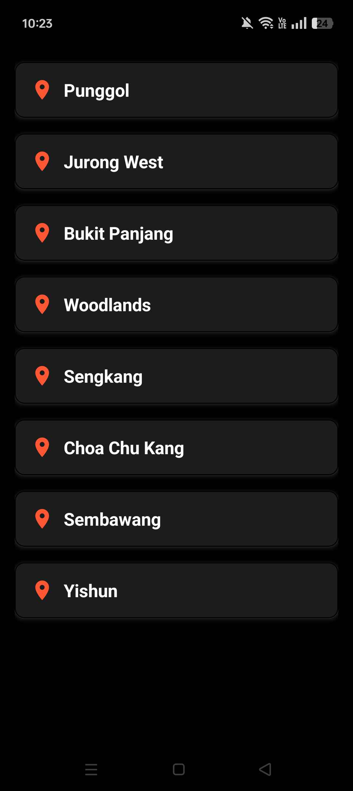
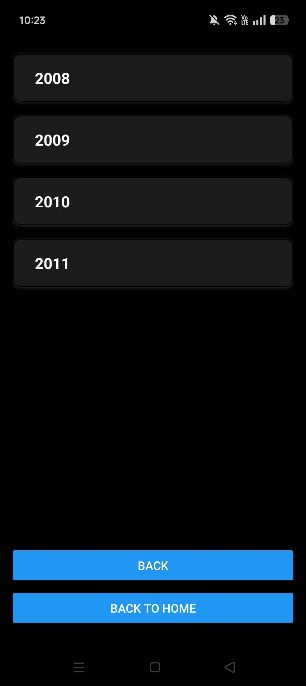
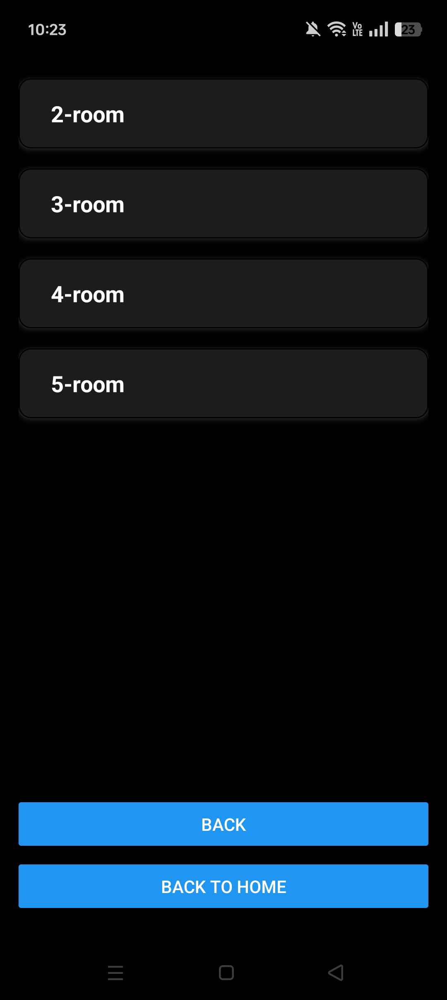
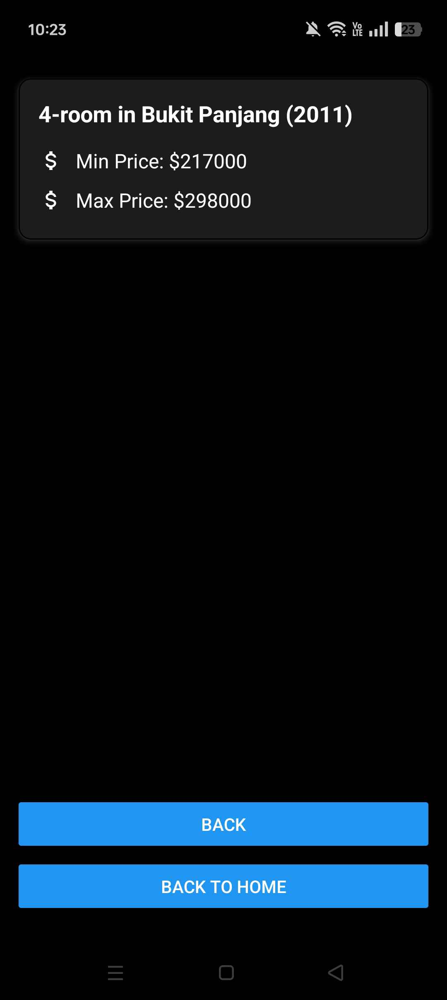

# [HDB price check app]

## 📌 About This App

This app is about checking the HDB prices of each town in Singapore. Users will be able to navigate between each town, each year, each room and find out the details of the searched housing prices.
---

## ✨ Notable Features

Real-Time Data – Access up-to-date housing price data sourced directly from government APIs.

User-Friendly Interface – Easy navigation with clearly organized information for quick decision-making.

Town-Based Search – Explore housing prices by selecting different towns.

Yearly Breakdown – View housing prices categorized by financial year.

Room Type Filtering – Compare prices based on different room types (e.g., 2-room, 3-room, etc.).
---

## 📸 Screenshots

Showcase the app’s interface with relevant screenshots. Add meaningful captions for each screenshot.

> *Home Screen - Overview of towns*

> *Year Screen - Overview of years*

> *Room type Screen - Overview of room types*

> *Details Screen - Overall details of the house*
---

## 🎥 Video Walkthrough

Provide a short demo video or walkthrough of the app.

[

---
